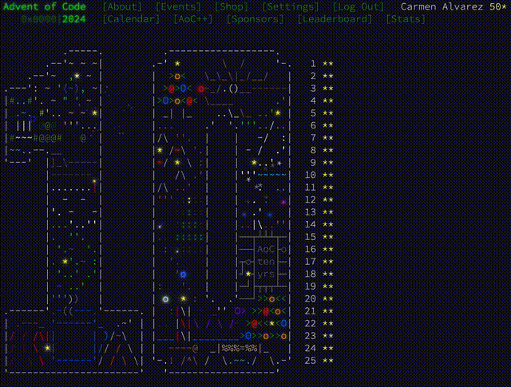

# Advent of code exercises

These are my exercises for [Advent of Code](https://adventofcode.com/).

2024 is the first year I ever completed Advent of Code. I chose COBOL as
the langauge. I did the exercises over a period of a month and a half
(may - june 2025).

I did participate in previous years, but haven't completed those years
yet:
* 2023: 26 / 50 stars, python.
* 2022: 43 / 50 stars, python and javascript.

The code is not very pretty! 😅

But I'm putting it here:
* Perhaps this project can help someone who is stuck on one of the exercises.
* To share what I've been up to over the last couple of months, on my free time.

For now I've just included the exercises for 2024. Perhaps I'll add the code from
previous years at some point.

## License
The files are licensed under the GPLv3. See see [COPYING](COPYING) file.
